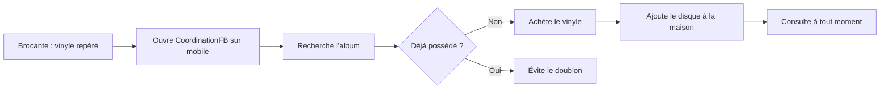

# 🎵 Persona — CoordinationFB

> **Objectif du projet :** permettre aux collectionneurs de gérer leurs vinyles au même endroit, simplement et efficacement.

---

## Sommaire

1. [Profil utilisateur](#1-profil-utilisateur)
2. [Présentation](#2-présentation)
3. [Objectifs](#3-objectifs)
4. [Besoins](#4-besoins)
5. [Frustrations](#5-frustrations)
6. [Habitudes d'utilisation](#6-habitudes-dutilisation)
7. [Motivations](#7-motivations)
8. [Citation représentative](#8-citation-représentative)
9. [Scénario d'utilisation](#9-scénario-dutilisation)
10. [Fonctionnalités prioritaires](#10-fonctionnalités-prioritaires)
11. [Synthèse](#11-synthèse)

---

## 1. Profil utilisateur

| Information | Détail |
|---|---|
| **Nom** | Thomas Morel |
| **Âge** | 32 ans |
| **Profession** | Technicien informatique |
| **Localisation** | Strasbourg, France |
| **Niveau en informatique** | Bon |
| **Type d'utilisateur** | Collectionneur de vinyles |
| **Taille de la collection** | Plus de 200 vinyles |

---

## 2. Présentation

Thomas est un passionné de musique qui collectionne des vinyles depuis plusieurs années. Sa collection est principalement composée de **rock**, de **jazz** et de **musique électronique**.

Il achète régulièrement de nouveaux disques dans des disquaires, des brocantes et sur Internet. Avec le temps, il devient difficile de se souvenir de tous les albums qu'il possède et de retrouver rapidement les informations associées.

Il souhaite donc utiliser **CoordinationFB** pour centraliser et gérer l'ensemble de sa collection.

---

## 3. Objectifs

- [x] Centraliser sa collection de vinyles dans une seule application
- [x] Ajouter facilement de nouveaux disques
- [x] Consulter les informations de chaque album
- [x] Retrouver rapidement un vinyle grâce à la recherche
- [x] Organiser sa collection selon ses préférences
- [x] Éviter d'acheter plusieurs fois le même disque
- [x] Suivre l'évolution de sa collection

---

## 4. Besoins

- Une **interface simple, claire et intuitive**
- Un **formulaire** pour ajouter un vinyle
- Une **liste** permettant de visualiser toute sa collection
- Un **système de recherche rapide**
- La possibilité de **consulter et de modifier** les informations d'un vinyle
- Une interface **adaptée aux ordinateurs et aux appareils mobiles** (responsive)

---

## 5. Frustrations

| Frustration | Impact |
|---|---|
| Il oublie parfois quels albums il possède déjà | Risque de doublons à l'achat |
| Ses informations sont dispersées entre plusieurs supports | Manque de vue d'ensemble |
| Il perd du temps à rechercher un disque précis | Perte de temps |
| Certaines applications de gestion sont trop complexes | Abandon de l'outil |
| La saisie répétitive des informations peut entraîner des erreurs | Données peu fiables |

---

## 6. Habitudes d'utilisation

- 📅 Il consulte sa collection **plusieurs fois par semaine**
- ➕ Il ajoute ses **nouveaux achats** à son inventaire
- 🔍 Il **vérifie sa collection avant d'acheter** un album
- 💻 Il utilise principalement son **ordinateur à domicile**
- 📱 Il consulte également sa collection sur son **téléphone** lorsqu'il se rend dans un disquaire ou une brocante

---

## 7. Motivations

- Préserver et valoriser sa collection personnelle
- Garder une vue d'ensemble de ses disques
- Retrouver facilement ses albums préférés
- Identifier les albums qu'il ne possède pas encore
- Gagner du temps dans la gestion de sa collection

---

## 8. Citation représentative

> *« Je veux pouvoir retrouver tous mes vinyles au même endroit et savoir rapidement si je possède déjà un album avant de l'acheter. »*
>
> — **Thomas Morel**

---

## 9. Scénario d'utilisation

1. Thomas se rend dans une **brocante** et trouve un vinyle qui l'intéresse.
2. Il ouvre **CoordinationFB** sur son téléphone.
3. Il **recherche** l'album dans sa collection.
4. Il constate qu'il **ne possède pas encore** ce disque.
5. Il **achète** le vinyle et l'**ajoute** à sa collection une fois rentré chez lui.
6. Il peut ensuite **consulter et retrouver** ce disque à tout moment depuis l'application.

---

## 10. Fonctionnalités prioritaires

| Priorité | Fonctionnalité | Description |
|:---:|---|---|
| 🔴 **Haute** | Consulter la collection | Afficher l'ensemble des vinyles enregistrés |
| 🔴 **Haute** | Ajouter un vinyle | Enregistrer un nouveau disque |
| 🔴 **Haute** | Rechercher un vinyle | Retrouver rapidement un album |
| 🔴 **Haute** | Consulter les détails | Afficher les informations d'un disque |
| 🟠 **Moyenne** | Modifier un vinyle | Corriger ou compléter ses informations |
| 🟠 **Moyenne** | Supprimer un vinyle | Retirer un disque de la collection |
| 🟠 **Moyenne** | Filtrer et trier | Organiser les vinyles selon différents critères |

---

## 11. Synthèse

Thomas représente l'utilisateur cible de **CoordinationFB**. Il recherche une solution centralisée, rapide et facile à utiliser pour gérer sa collection de vinyles.

L'application doit privilégier :

| Principe | Description |
|---|---|
| **Simplicité** | Une interface intuitive et facile à comprendre |
| **Efficacité** | Un accès rapide aux informations et à la recherche |
| **Fiabilité** | Des données correctement enregistrées et mises à jour |
| **Accessibilité** | Une consultation confortable sur ordinateur et mobile |

> Ce persona constitue une **référence commune aux équipes front-end et back-end** pour orienter les choix fonctionnels et techniques du projet.
